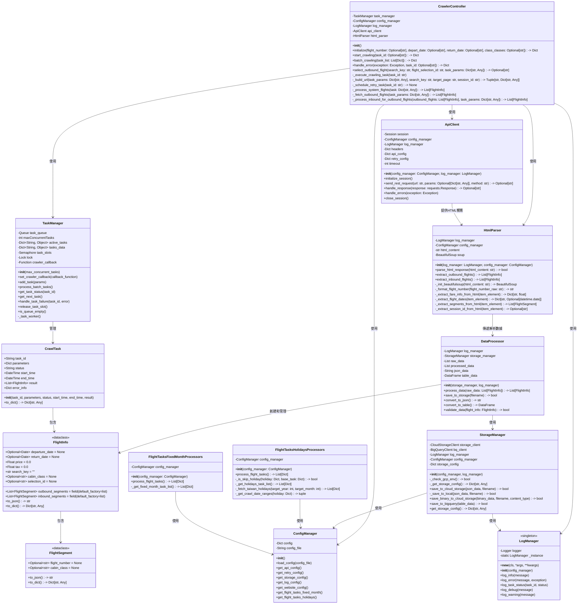

# 山富機票資料爬蟲系統 - 類別圖

## 類別圖概述

本文件描述山富旅遊機票資料爬蟲系統的類別設計。類別圖展示了系統中各個類別的結構、職責以及它們之間的關係，為系統實現提供了藍圖。

## Mermaid 類別圖代碼

## 類別職責詳細說明

### 1. 控制與管理類

#### `CrawlerController`（爬蟲控制器）
- **職責**：作為系統的主要入口點，協調整個爬蟲流程，管理任務執行，並實現去程和回程航班的分步抓取與組合邏輯
- **主要方法**：
  - `__init__()`: 初始化爬蟲控制器，載入配置、初始化日誌、任務管理器、API客戶端和HTML解析器。
  - `initialize(flight_number: Optional[str] = None, depart_date: Optional[str] = None, return_date: Optional[str] = None, class_classes: Optional[str] = None) -> Dict`: 初始化爬蟲參數並創建一個新任務，支援艙等參數。
  - `start_crawling(task_id: Optional[str] = None) -> Dict`: 開始單個爬蟲任務，如果未提供 task_id，則執行隊列中的下一個任務。
  - `batch_crawling(task_list: List[Dict]) -> Dict`: 批次執行多個爬蟲任務。
  - `handle_error(exception: Exception, task_id: Optional[str] = None) -> Dict`: 處理錯誤情況，並根據配置執行重試邏輯。
  - `select_outbound_flight(search_key: str, flight_selection_id: str, task_params: Dict[str, Any]) -> Optional[str]`: 選擇特定的去程航班，獲得該去程對應的回程查詢 search_key。
  - `_execute_crawling_task(task_id: str)`: 執行單個爬蟲任務（由任務管理器回調），協調整個爬蟲流程。
  - `_build_url(task_params: Dict[str, Any], search_key: str = "", target_page: str = "", session_id: str = "") -> Tuple[str, Dict[str, Any]]`: 根據任務數據構建山富旅遊 RESTful API 查詢URL和參數，支援分頁和回程查詢。
  - `_schedule_retry_task(task_id: str) -> None`: 安排任務重試，將任務重新加入隊列。
  - `_process_system_flights(task: Dict[str, Any]) -> List[FlightInfo]`: 處理單一系統的完整航班查詢流程（去程 + 回程組合），支援多個艙等查詢。
  - `_fetch_outbound_flights(task_params: Dict[str, Any]) -> List[FlightInfo]`: 抓取並解析指定艙等的去程航班，支援分頁處理。
  - `_process_inbound_for_outbound_flights(outbound_flights: List[FlightInfo], task_params: Dict[str, Any]) -> List[FlightInfo]`: 為每個已解析的去程航班抓取並組合回程航班，支援分頁處理。
- **關聯**：
  - 使用 `TaskManager` 管理爬蟲任務
  - 使用 `ConfigManager` 獲取配置信息
  - 使用 `LogManager` 記錄系統日誌
  - 使用 `ApiClient` 進行HTTP請求
  - 使用 `HtmlParser` 進行HTML解析

#### `TaskManager`（任務管理器）
- **職責**：管理爬蟲任務隊列，控制並行任務數量，確保系統資源合理利用
- **主要屬性**：
  - `task_queue`: 任務隊列，存儲待執行的任務
  - `maxConcurrentTasks`: 最大並行任務數，設定為4
  - `active_tasks`: 當前活動的任務字典，鍵為任務ID，值為任務參數
  - `tasks_data`: 所有任務數據字典，包括已完成的任務
  - `task_slots`: 信號量，用於控制並行任務數
  - `lock`: 線程鎖，用於同步訪問共享資源
  - `crawler_callback`: 爬蟲控制器回調函數
- **主要方法**：
  - `__init__(max_concurrent_tasks)`: 初始化任務管理器，設置最大並行任務數
  - `set_crawler_callback(callback_function)`: 設置爬蟲控制器回調函數
  - `add_task(params)`: 添加新任務到隊列
  - `process_batch_tasks()`: 處理批量任務
  - `get_task_status(task_id)`: 獲取任務狀態
  - `get_next_task()`: 獲取隊列中的下一個任務
  - `handle_task_failure(task_id, error)`: 處理任務失敗
  - `release_task_slot()`: 釋放任務槽位，允許執行下一個任務
  - `is_queue_empty()`: 檢查隊列是否為空
  - `_task_worker()`: 任務工作線程函數
- **關聯**：
  - 創建和管理 `ApiClient` 實例
  - 管理 `CrawlTask` 對象

### 2. Web客戶端與網頁抓取類

#### `ApiClient`（Web客戶端）
- **職責**：負責發送 RESTful API 請求到山富旅遊網站，獲取JSON響應並處理HTTP錯誤，模擬瀏覽器行為進行API調用。
- **主要屬性**：
  - `session`: Requests庫的Session實例，用於發送HTTP請求
  - `config_manager`: 配置管理器實例 (ConfigManager)
  - `log_manager`: 日誌管理器實例 (LogManager)
  - `headers`: HTTP 請求標頭 (Dict[str, str])，模擬瀏覽器標頭
  - `api_config`: API相關配置 (Dict)，包括超時、認證等
  - `retry_config`: 重試相關配置 (Dict)，從配置管理器獲取
  - `timeout`: 請求超時時間 (int)
- **主要方法**：
  - `__init__(config_manager, log_manager)`: 初始化Web客戶端，設置配置管理器和日誌管理器。
  - `initialize_session()`: 初始化HTTP會話，設置請求標頭、超時等。
  - `send_rest_request(url: str, params: Optional[Dict[str, Any]] = None, method: str = 'GET') -> Optional[str]`: 發送 RESTful 請求到指定URL，返回響應內容。
  - `handle_response(response: requests.Response) -> Optional[str]`: 處理HTTP響應，檢查狀態碼並返回內容。
  - `handle_errors(exception: Exception)`: 處理請求過程中的錯誤和異常。
  - `close_session()`: 關閉HTTP會話，釋放資源。
- **關聯**：
  - 使用 `ConfigManager` 獲取配置信息
  - 使用 `LogManager` 記錄日誌

### 3. 數據處理類

#### `HtmlParser`（HTML解析器）
- **職責**：解析山富旅遊網站返回的 HTML 頁面，使用 BeautifulSoup 提取機票資料，處理去程和回程航班的解析。
- **主要屬性**：
  - `log_manager`: 日誌管理器實例，用於記錄解析過程中的信息 (LogManager)
  - `config_manager`: 配置管理器實例，用於獲取解析配置 (ConfigManager)
  - `html_content`: 網站返回的原始 HTML 內容 (str)
  - `soup`: BeautifulSoup 解析器實例 (BeautifulSoup)
- **主要方法**：
  - `__init__(log_manager: LogManager, config_manager: ConfigManager)`: 初始化HTML解析器
  - `parse_html_response(html_content: str) -> bool`: 解析HTML頁面內容，初始化BeautifulSoup解析器
  - `extract_outbound_flights() -> List[FlightInfo]`: 從HTML中提取去程航班選項
  - `extract_inbound_flights() -> List[FlightInfo]`: 從HTML中提取回程航班選項
  - `_extract_fare_info_from_html(item_element) -> Dict[str, float]`: 從單個航班的HTML元素中提取總票價和稅金
  - `_extract_segments_from_html(item_element) -> List[FlightSegment]`: 從單個航班的HTML元素中提取所有航段資料
  - `_extract_flight_dates(item_element) -> Dict[str, Optional[datetime.date]]`: 從單個航班的HTML元素中提取出發與回程日期
  - `_extract_session_id_from_html(item_element) -> Optional[str]`: 從去程航班HTML元素中提取session_id
- **關聯**：
  - 創建 `FlightInfo` 對象
  - 創建 `FlightSegment` 對象

#### `DataProcessor`（數據處理器）
- **職責**：處理和轉換爬取的數據，準備存儲
- **主要屬性**：
  - `log_manager`: 日誌管理器實例
  - `storage_manager`: 存儲管理器實例
  - `raw_data`: 原始數據
  - `processed_data`: 處理後的數據
  - `json_data`: JSON格式數據
  - `table_data`: 表格格式數據
- **主要方法**：
  - `__init__(storage_manager, log_manager)`: 初始化數據處理器
  - `process_data(raw_data: List[FlightInfo]) -> List[FlightInfo]`: 處理原始數據並返回處理後的數據
  - `save_to_storage(filename) -> bool`: 將數據保存到存儲系統
  - `convert_to_json() -> str`: 轉換為JSON格式
  - `convert_to_table() -> DataFrame`: 轉換為表格格式
  - `validate_data(flight_info: FlightInfo) -> bool`: 驗證航班信息的完整性和有效性
- **關聯**：
  - 使用 `StorageManager` 存儲數據
  - 創建和管理 `FlightInfo` 對象

### 4. 存儲管理類

#### `StorageManager`（存儲管理器）
- **職責**：管理數據存儲操作，與Cloud Storage和BigQuery交互
- **主要屬性**：
  - `storage_client`: Cloud Storage客戶端
  - `bq_client`: BigQuery客戶端
  - `log_manager`: 日誌管理器實例
  - `config_manager`: 配置管理器實例
  - `storage_config`: 存儲相關配置
- **主要方法**：
  - `__init__(config_manager, log_manager)`: 初始化存儲管理器
  - `save_to_cloud_storage(json_data, filename) -> bool`: 保存JSON數據到雲端存儲
  - `save_to_bigquery(table_data) -> bool`: 保存表格數據到BigQuery
  - `get_storage_config() -> Dict[str, Any]`: 獲取存儲配置
- **關聯**：
  - 使用 `ConfigManager` 獲取配置信息
  - 使用 `LogManager` 記錄日誌

### 5. 配置與日誌類

#### `ConfigManager`（配置管理器）
- **職責**：管理系統配置，加載和提供各種配置項
- **主要屬性**：
  - `config`: 配置字典
  - `config_file`: 配置文件路徑
- **主要方法**：
  - `__init__()`: 初始化配置管理器
  - `load_config(config_file)`: 加載配置文件
  - `get_api_config()`: 獲取API配置
  - `get_retry_config()`: 獲取重試配置
  - `get_storage_config()`: 獲取存儲配置

#### `LogManager`（日誌管理器）
- **職責**：管理系統日誌記錄，採用單例模式
- **主要方法**：
  - `log_info(message)`: 記錄信息日誌
  - `log_error(message, exception)`: 記錄錯誤日誌
  - `log_task_status(task_id, status)`: 記錄任務狀態
  - `log_debug(message)`: 記錄調試日誌
  - `log_warning(message)`: 記錄警告日誌

### 6. 數據模型類

#### `FlightInfo`（航班資訊）
- **職責**：表示單個機票的完整資訊，包含去程和回程的所有航段
- **主要屬性**：
  - `departure_date`: 出發日期
  - `return_date`: 返回日期
  - `price`: 票價
  - `tax`: 稅金
  - `outbound_segments`: 去程航段列表
  - `inbound_segments`: 回程航段列表
  - `search_key`: 搜尋令牌
  - `cabin_class`: 艙等
  - `selection_id`: 用於存放每個航班的唯一選擇ID

#### `FlightSegment`（航班段）
- **職責**：表示單個航班段的詳細資訊
- **主要屬性**：
  - `flight_number`: 航班編號
  - `cabin_class`: 艙等

#### `CrawlTask`（爬蟲任務）
- **職責**：表示單個爬蟲任務的狀態與結果
- **主要屬性**：
  - `task_id`: 任務ID
  - `parameters`: 爬蟲參數
  - `status`: 任務狀態
  - `start_time`: 開始時間
  - `end_time`: 結束時間
  - `result`: 任務結果

### 7. 任務生成處理器類

#### `FlightTasksHolidaysProcessors`（節日爬蟲任務處理器）
- **職責**：根據配置文件中定義的基礎航線任務和目標月份，結合從外部API獲取的台灣國定假日資訊，動態生成具體的航班爬取任務。處理邏輯包含計算目標年月份、獲取節假日、根據節假日類型和星期決定實際的爬取日期範圍（例如，提前幾天或延後幾天），並處理特定節日（如開國紀念日、春節）的特殊日期規則，以及一個跳過特定日期組合的邏輯（`_is_skip_holiday`）。
- **主要屬性**：
  - `config_manager`: 配置管理器實例 (`ConfigManager`)，用於獲取節日任務的基礎配置。
- **主要方法**：
  - `__init__(config_manager: ConfigManager)`: 初始化節日爬蟲任務處理器。
  - `process_flight_tasks() -> List[Dict]`: 處理並生成所有節日相關的爬蟲任務列表。
  - `_is_skip_holiday(holiday: Dict, base_task: Dict) -> bool`: 判斷是否根據特定規則（例如節日日期與固定月份任務的日期重疊）跳過當前節假日的處理。
  - `_get_holidays_task_list() -> List[Dict]`: 從配置管理器獲取節日爬蟲的基礎任務列表。
  - `_fetch_taiwan_holidays(target_year: int, target_month: int) -> List[Dict]`: 從外部API獲取指定年月的台灣官方節假日數據。
  - `_get_crawl_date_ranges(holiday: Dict) -> tuple`: 根據節假日信息（如描述、星期）決定爬取的出發和返回日期範圍。
- **關聯**：
  - 使用 `ConfigManager` 獲取配置信息。

#### `FlightTasksFixedMonthProcessors`（固定月份日期爬蟲任務處理器）
- **職責**：根據配置文件中定義的基礎航線任務和指定的未來月份及日期（日），生成具體的航班爬取任務。處理邏輯包括計算目標年月份，並將配置中的相對日期（例如下下個月的5號到10號）轉換為絕對的出發和返回日期。
- **主要屬性**：
  - `config_manager`: 配置管理器實例 (`ConfigManager`)，用於獲取固定月份任務的基礎配置。
- **主要方法**：
  - `__init__(config_manager: ConfigManager)`: 初始化固定月份日期爬蟲任務處理器。
  - `process_flight_tasks() -> List[Dict]`: 處理並生成所有固定月份日期相關的爬蟲任務列表。
  - `_get_fixed_month_task_list() -> List[Dict]`: 從配置管理器獲取固定月份日期爬蟲的基礎任務列表。
- **關聯**：
  - 使用 `ConfigManager` 獲取配置信息。