# 山富旅遊機票資料爬蟲系統 - 序列圖

## 序列圖概述

本文件描述山富旅遊機票資料爬蟲系統的工作流程序列圖。此序列圖展示了系統如何根據指定參數（去程日期、回程日期、艙等）從山富旅遊網站獲取 HTML 頁面，解析機票資料，並將資料存儲到 Cloud Storage 和 BigQuery 中的完整流程。

## Mermaid 序列圖代碼

```mermaid
sequenceDiagram
    actor 系統管理員
    participant 爬蟲控制器
    participant 任務管理器
    participant CrawlTask
    participant HtmlParser
    participant API客戶端
    participant 數據處理器
    participant StorageManager
    participant FlightInfo
    participant Cloud Storage
    participant BigQuery

    %% 初始化與參數接收
    rect rgb(100, 100, 100)
        Note over 系統管理員,爬蟲控制器: 初始化與參數接收
        系統管理員->>爬蟲控制器: 提供航班編號、去程日期、回程日期、艙等
        activate 爬蟲控制器
        爬蟲控制器->>爬蟲控制器: 初始化配置管理器、日誌管理器、API客戶端、HTML解析器
        爬蟲控制器->>任務管理器: 初始化任務管理器(最大並行任務數=4)
        activate 任務管理器
        爬蟲控制器->>任務管理器: 設置回調函數(_execute_crawling_task)
    end

    %% 任務創建與管理
    rect rgb(100, 100, 100)
        Note over 爬蟲控制器,CrawlTask: 任務創建與管理
        爬蟲控制器->>CrawlTask: 創建爬蟲任務對象
        activate CrawlTask
        CrawlTask-->>爬蟲控制器: 返回任務對象
        爬蟲控制器->>任務管理器: 添加任務(CrawlTask)
        任務管理器->>任務管理器: 將任務加入隊列
        Note right of 任務管理器: 使用 Semaphore 控制並行度
    end

    %% 任務執行與回調調用
    rect rgb(100, 100, 100)
        Note over 任務管理器,爬蟲控制器: 任務執行與回調調用
        任務管理器->>任務管理器: 處理隊列中的任務
        任務管理器->>爬蟲控制器: 調用回調函數(_execute_crawling_task)
        Note right of 任務管理器: 通過回調機制將控制權交給爬蟲控制器
    end

    %% 爬蟲控制器核心邏輯執行
    rect rgb(100, 100, 100)
        Note over 爬蟲控制器,API客戶端: 爬蟲控制器核心邏輯執行
        爬蟲控制器->>CrawlTask: 更新任務狀態為執行中
        爬蟲控制器->>爬蟲控制器: 根據任務參數生成 request 查詢
        爬蟲控制器->>API客戶端: 創建API客戶端
        activate API客戶端
        API客戶端->>API客戶端: 設置請求標頭
    end

    %% API請求與HTML響應
    rect rgb(100, 100, 100)
        Note over 爬蟲控制器,HtmlParser: 去程航班分頁抓取
        爬蟲控制器->>爬蟲控制器: 初始化去程航班收集列表
        loop 處理去程分頁
            爬蟲控制器->>爬蟲控制器: 構建去程查詢URL(_build_url)
            爬蟲控制器->>API客戶端: 發送RESTful請求(send_rest_request)
            activate API客戶端
            API客戶端-->>爬蟲控制器: 返回JSON響應(含flights_html和page_count)
            deactivate API客戶端
            爬蟲控制器->>爬蟲控制器: 解析JSON並提取flights_html和page_count
            爬蟲控制器->>HtmlParser: 解析去程HTML
            activate HtmlParser
            HtmlParser->>HtmlParser: 使用extract_outbound_flights()提取航班
            HtmlParser->>HtmlParser: 基於w-100元素解析航段資料
            HtmlParser->>FlightInfo: 創建FlightInfo對象
            activate FlightInfo
            FlightInfo-->>HtmlParser: 返回航班對象
            deactivate FlightInfo
            HtmlParser->>HtmlParser: 提取selection_id和search_key
            HtmlParser-->>爬蟲控制器: 返回本頁去程航班列表
            deactivate HtmlParser
            爬蟲控制器->>爬蟲控制器: 將本頁航班加入總列表
            alt page_count > 當前頁面
                爬蟲控制器->>爬蟲控制器: 頁面計數器+1，添加延遲
            else 已處理完所有頁面
                Note right of 爬蟲控制器: 跳出分頁迴圈
            end
        end
    end

    %% 數據處理與轉換
    rect rgb(100, 100, 100)
        Note over 爬蟲控制器,HtmlParser: 回程航班組合處理
        爬蟲控制器->>爬蟲控制器: 選擇特定去程航班(select_outbound_flight)
        爬蟲控制器->>爬蟲控制器: 獲取該去程航班的search_key
        loop 為每個去程航班(outbound_flight)
            爬蟲控制器->>爬蟲控制器: 構建回程查詢URL(帶search_key和selection_id)
            爬蟲控制器->>API客戶端: 發送回程查詢請求(send_rest_request)
            activate API客戶端
            API客戶端-->>爬蟲控制器: 返回回程JSON響應(含flights_html)
            deactivate API客戶端
            
            爬蟲控制器->>HtmlParser: 解析回程HTML
            activate HtmlParser
            HtmlParser->>HtmlParser: 提取回程航班列表(extract_inbound_flights)
            HtmlParser->>FlightInfo: 創建回程FlightInfo對象
            activate FlightInfo
            FlightInfo-->>HtmlParser: 返回回程航班對象
            deactivate FlightInfo
            HtmlParser-->>爬蟲控制器: 返回所有回程航班(inbound_flights)
            deactivate HtmlParser
            
            爬蟲控制器->>爬蟲控制器: 遍歷回程航班列表
            爬蟲控制器->>FlightInfo: 組合去程+回程創建完整FlightInfo
            activate FlightInfo
            FlightInfo-->>爬蟲控制器: 返回完整航程對象
            deactivate FlightInfo
            Note right of 爬蟲控制器: 每個去程航班與每個回程航班<br>組合成一個完整的來回程航程
        end
    end

    %% 數據存儲
    rect rgb(100, 100, 100)
        Note over 爬蟲控制器,BigQuery: 數據存儲
        爬蟲控制器->>數據處理器: 請求存儲數據(FlightInfo列表)
        activate 數據處理器
        數據處理器->>數據處理器: 驗證和轉換數據
        數據處理器->>數據處理器: 轉換為JSON格式
        數據處理器->>StorageManager: 請求存儲JSON到Cloud Storage
        activate StorageManager
        StorageManager->>Cloud Storage: 存儲JSON檔案
        activate Cloud Storage
        Cloud Storage-->>StorageManager: 存儲確認
        deactivate Cloud Storage
        StorageManager-->>數據處理器: JSON存儲完成

        數據處理器->>數據處理器: 轉換為表格格式
        數據處理器->>StorageManager: 請求存儲到BigQuery
        StorageManager->>BigQuery: 存儲表格數據
        activate BigQuery
        BigQuery-->>StorageManager: 存儲確認
        deactivate BigQuery
        StorageManager-->>數據處理器: BigQuery存儲完成
        deactivate StorageManager

        數據處理器-->>爬蟲控制器: 所有存儲操作完成確認
        deactivate 數據處理器
    end

    %% 錯誤處理與重試機制
    rect rgb(100, 100, 100)
        Note over 爬蟲控制器: 錯誤處理與重試機制
        alt 任務執行失敗
            爬蟲控制器->>爬蟲控制器: 調用handle_error處理錯誤
            爬蟲控制器->>爬蟲控制器: 判斷是否需要重試
            alt 需要重試
                爬蟲控制器->>爬蟲控制器: 設置Timer定時器
                爬蟲控制器->>CrawlTask: 更新任務狀態為重試中
                爬蟲控制器->>爬蟲控制器: Timer觸發_schedule_retry_task
                爬蟲控制器->>CrawlTask: 重置任務狀態為初始化
                爬蟲控制器->>任務管理器: 重新添加任務到隊列
            else 不需要重試
                爬蟲控制器->>CrawlTask: 更新任務狀態為失敗
            end
        end
    end

    %% 資源釋放與完成
    rect rgb(100, 100, 100)
        Note over 爬蟲控制器,系統管理員: 資源釋放與完成
        爬蟲控制器->>API客戶端: 釋放API客戶端資源
        deactivate API客戶端
        爬蟲控制器->>CrawlTask: 更新任務狀態為完成
        deactivate CrawlTask
        爬蟲控制器->>任務管理器: 返回任務執行結果
        任務管理器->>任務管理器: 釋放任務槽位
        任務管理器-->>爬蟲控制器: 任務完成通知
        deactivate 任務管理器
        爬蟲控制器->>爬蟲控制器: 獲取任務結果
        爬蟲控制器-->>系統管理員: 返回任務執行結果與狀態
        deactivate 爬蟲控制器
    end
```

## 序列圖詳細說明

序列圖展示了山富旅遊機票爬蟲系統的完整流程，主要分為以下幾個階段：

### 1. 初始化與參數接收
- **參與者**：系統管理員、爬蟲控制器、任務管理器
- **描述**：系統管理員提供必要參數（航班編號、去程日期、回程日期），爬蟲控制器接收這些參數並初始化系統組件。
- **輸入**：航班編號、去程日期、回程日期
- **輸出**：初始化的系統組件
- **關鍵點**：爬蟲控制器設置自身的回調函數給任務管理器，用於執行爬蟲任務

### 2. 任務創建與管理
- **參與者**：爬蟲控制器、任務管理器、CrawlTask
- **描述**：爬蟲控制器創建 CrawlTask 對象並將其交給任務管理器，由任務管理器負責管理任務隊列和控制並行執行。
- **技術細節**：
  - 使用 CrawlTask 對象表示任務。
  - 任務管理器維護任務隊列和活動任務。
  - 使用 Semaphore 控制並行任務數量。

### 3. 任務執行與回調調用
- **參與者**：任務管理器、爬蟲控制器
- **描述**：任務管理器處理隊列中的任務，並通過回調機制將實際的執行控制權交給爬蟲控制器。
- **技術細節**：
  - 任務管理器調用之前註冊的爬蟲控制器回調函數
  - 使用回調機制將控制流從任務管理器轉到爬蟲控制器
  - 任務管理器專注於並行控制，而非實際的爬蟲邏輯

### 4. 爬蟲控制器核心邏輯執行
- **參與者**：爬蟲控制器、API客戶端、CrawlTask
- **描述**：爬蟲控制器執行核心爬蟲邏輯，包括更新任務狀態、生成查詢和創建 API 客戶端。
- **技術細節**：
  - 爬蟲控制器直接更新 CrawlTask 狀態
  - 爬蟲控制器根據任務參數構建 request 查詢
  - 爬蟲控制器創建和使用 API 客戶端

### 5. API請求與HTML響應
- **參與者**：爬蟲控制器、API客戶端、HtmlParser
- **描述**：爬蟲控制器通過 API 客戶端發送 GET 請求，接收 HTML 響應，並使用 HtmlParser 解析結果。
- **技術細節**：
  - 爬蟲控制器管理 API 請求流程
  - 響應數據由爬蟲控制器接收並傳遞給 HtmlParser
  - HtmlParser 負責解析和結構化數據，將網頁內容轉換為 FlightInfo 物件列表。

### 6. 數據處理與轉換
- **參與者**：爬蟲控制器、數據處理器、CrawlTask
- **描述**：爬蟲控制器使用去程查詢返回的 search_key 構建回程查詢，並使用 HtmlParser 解析回程航班列表，並更新任務結果。
- **技術細節**：
  - 爬蟲控制器創建數據處理器實例
  - 數據處理器進行驗證、轉換和模型創建
  - 爬蟲控制器更新 CrawlTask 的結果

### 7. 數據存儲
- **參與者**：爬蟲控制器、數據處理器、Cloud Storage、BigQuery
- **描述**：爬蟲控制器請求數據處理器將數據存儲到適當位置。
- **技術細節**：
  - 數據處理器負責格式轉換和存儲操作。
  - 數據處理器直接與存儲服務交互。

### 8. 錯誤處理與重試機制
- **參與者**：爬蟲控制器、CrawlTask、任務管理器
- **描述**：當任務執行失敗時，爬蟲控制器執行錯誤處理和重試邏輯。
- **技術細節**：
  - 爬蟲控制器捕獲和處理執行過程中的錯誤
  - 爬蟲控制器通過 Timer 計時器實現延遲重試
  - 重試任務會被重新添加到任務隊列
  - 爬蟲控制器負責更新任務的重試狀態

### 9. 資源釋放與完成
- **參與者**：爬蟲控制器、API客戶端、CrawlTask、任務管理器、系統管理員
- **描述**：任務完成後，釋放資源，更新任務狀態，通知爬蟲控制器。
- **技術細節**：
  - 爬蟲控制器負責釋放 API 客戶端資源
  - 爬蟲控制器更新任務狀態為完成
  - 任務管理器釋放任務槽位
  - 爬蟲控制器向系統管理員報告執行結果

## 非同步處理考量

為了滿足在2小時內完成30組抓取任務的需求，系統採用非同步處理機制：

1. **任務佇列**：使用 Python 的 queue.Queue 實現任務隊列管理。
2. **並行執行限制**：使用 Semaphore 控制同時最多執行4個爬蟲任務。
3. **資源管理**：根據系統資源限制，合理分配CPU和記憶體資源。
4. **錯誤處理**：實現錯誤重試機制，當API請求失敗時能夠自動重試。
5. **任務優先級**：可以實現任務優先級機制，確保重要任務優先執行。
6. **回調機制**：使用回調函數將任務執行控制權從任務管理器轉交給爬蟲控制器。

## 安全與反爬蟲考量

1. **請求間隔**：在連續請求之間添加隨機延遲，避免超過API的請求頻率限制。
2. **請求標頭**：設置適當的請求標頭，模擬正常的API客戶端行為。
3. **錯誤處理**：實現完整的錯誤處理機制，包括重試策略和錯誤日誌記錄。
4. **API限制**：遵守API的使用條款和限制，確保合規使用。 